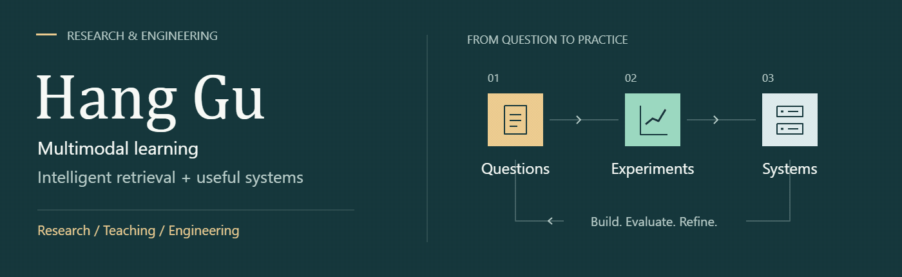

  <picture>
    <source media="(prefers-reduced-motion: reduce)" srcset="assets/research-still.png" />
    
  </picture>

<a href="assets/research-still.png">静态横幅 / Static banner</a> · <a href="assets/README.md">原创动画 / Behind the animation</a>

  <a href="https://guhang2011.github.io/">Academic portfolio</a> ·
  <a href="https://guhang2011.github.io/#research">Research</a> ·
  <a href="https://github.com/GuHang2011/frontend-data-lab">Code & notes</a> ·
  <a href="https://github.com/GuHang2011/engineering-notes">Engineering field notes</a>

## About

I'm **Hang Gu (顾航)**, a lecturer and teaching section director at **江苏财经职业技术学院**, with an MSc in Computer Science (Data Science) from **Universiti Malaya** and a background in frontend engineering.

**Research focus:** multimodal learning, reliable evaluation with limited labels, and intelligent retrieval. I connect these interests with readable software and reproducible data experiments.

我关注多模态学习与智能检索在有限标注和实际工作流中的可靠评估。这里整理研究代码、工程案例与模型自学笔记，便于查看方法、复现步骤和已知限制。

## Selected work

| Work | Question / contribution | Read or try |
| :--- | :--- | :--- |
| **KICP · Research** | Multimodal fake-news detection with CLIP, learned prompts, co-attention and knowledge retrieval | [Research code & requirements](https://github.com/GuHang2011/KICP) |
| **Counselor Workflow · Engineering case** | Role-based interaction, state transitions, version checks and retry contracts; a curated static demonstration | [Online demo](https://guhang2011.github.io/counselor-workflow-showcase/) · [Code & architecture](https://github.com/GuHang2011/counselor-workflow-showcase) |
| **Frontend & Data Lab · Learning experiments** | Synthetic-data analytics, annotation agreement, bounded crawling and model-evaluation notes | [Interactive lab](https://guhang2011.github.io/frontend-data-lab/) · [Code & reading map](https://github.com/GuHang2011/frontend-data-lab/blob/main/REVIEWER_ENTRY.md) |

**Suggested reading:** try a demo → inspect the core code → read the verification steps and limitations. [Research reading guide](https://guhang2011.github.io/research/) · [Model self-study notes](https://github.com/GuHang2011/frontend-data-lab/blob/main/docs/modeling-reading-map.md).

Earlier coursework / 早期课程练习

- [WQD7006](https://github.com/GuHang2011/WQD7006): historical Python exercises in data collection, regional aggregation and visualization.
- [introdatascience](https://github.com/GuHang2011/introdatascience): early R exercises in extraction, data cleaning and JSON serialization.

The learning lab is a newly assembled educational example. It is separate from employer software and research experiments. KICP contains research code; its README describes the external data and assets required to run it.

## Engineering field notes / 工程实践

从本地高校资料归档与协作项目整理的原创笔记，记录设计取舍、验证结果和待完成的工作。附上线、容量测试与个人 AI 接入模板。

| Start with a question | Read / Use |
| :--- | :--- |
| “500 人在线”到底验证了什么？ | [容量复盘](https://github.com/GuHang2011/engineering-notes/blob/main/notes/capacity-testing.md) · [测试报告模板](https://github.com/GuHang2011/engineering-notes/blob/main/templates/capacity-report.md) |
| 每个账号如何使用自己的 AI？ | [密钥与模型接入](https://github.com/GuHang2011/engineering-notes/blob/main/notes/personal-ai-keys.md) · [验收表](https://github.com/GuHang2011/engineering-notes/blob/main/templates/ai-provider-checklist.md) |
| 从开发机到学校服务器还差什么？ | [部署笔记](https://github.com/GuHang2011/engineering-notes/blob/main/notes/campus-system-deployment.md) · [发布检查表](https://github.com/GuHang2011/engineering-notes/blob/main/templates/release-checklist.md) |

[全部 6 篇笔记 / All notes](https://github.com/GuHang2011/engineering-notes) · [官方资料导航 / Official reading](https://github.com/GuHang2011/engineering-notes/blob/main/resources/official-reading.md)

These are original notes and reusable checklists, with explicit testing limits. Linked references stay on their official sites; private product code and user data are not published here.

上传系统界面预览 / Upload system preview

来自本地 Edge/WebKit 自动化测试夹具的合成界面截图，仅用于展示布局和功能状态，不包含真实账号、API Key 或用户文件。

<table>
  <tr>
    <td></td>
    <td></td>
    <td></td>
  </tr>
</table>

[查看完整截图目录和说明](https://github.com/GuHang2011/engineering-notes/tree/main/screenshots)

## Research

- **Low-resource multimodal fake-news detection** — frozen CLIP adaptation, token-level fusion, and data-artifact analysis. Manuscript in journal resubmission.
- **Validation sensitivity in limited-label news classification** — model selection and paired validation sampling. Submitted to **DASFAA 2027**.
- **Vision-language multimodal behavior prediction** — visual, language and temporal information. Accepted at **ISCAIT 2026**.

My MSc thesis, *Dental Deformities Prediction Using Bayesian Networks among Adolescents*, used R and Bayesian networks to study conditional relationships in clinical data.

[Read the research overview →](https://guhang2011.github.io/#research)

## Engineering & teaching

- **Intelligent applications:** document parsing, entity extraction, semantic retrieval and RAG workflows.
- **Frontend systems:** Vue / React, TypeScript, dynamic forms, interface contracts, accessibility and performance.
- **Data systems:** Python, R, SQL, Hadoop / Spark, reproducible analysis and visualization.
- **Teaching:** computing courses and practical projects spanning data collection, storage, analysis and presentation.

Recent applied work includes an ongoing AI contract-management project, an ongoing intelligent information-retrieval project, and a completed modular administrative-dashboard project. These are described as experience; their proprietary source code is not part of this profile.

---

Profile and engineering notes updated October 2026. Research status is carried over from September 2026; see the <a href="https://guhang2011.github.io/">portfolio</a> for context.
