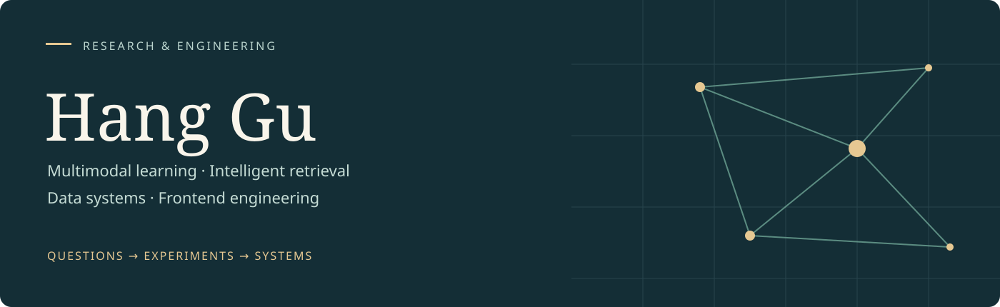

  

  <a href="https://guhang2011.github.io/">Academic portfolio</a> ·
  <a href="https://guhang2011.github.io/#research">Research</a> ·
  <a href="https://github.com/GuHang2011/frontend-data-lab">Code & notes</a>

## About

I'm **Hang Gu (顾航)**, a lecturer and teaching section director at **江苏财经职业技术学院**, with an MSc in Computer Science (Data Science) from **Universiti Malaya**. My work connects multimodal learning and intelligent retrieval with practical software and data systems.

Before moving into higher education, I worked in frontend engineering, including configurable forms, workflow interfaces, modular dashboards, and applications for unreliable network conditions.

**Research interests:** multimodal learning · evaluation with limited labels · retrieval-augmented generation · document understanding.

我关注智能模型如何在真实约束下得到可靠评估并融入业务系统。这份主页整理了我的研究代码、工程实践与数据分析学习笔记。

## Selected work

| Project | Focus | Explore |
| :--- | :--- | :--- |
| **KICP** | Multimodal fake-news detection experiments with CLIP, prompt learning, co-attention and knowledge retrieval | [Research code](https://github.com/GuHang2011/KICP) |
| **Frontend & Data Lab** | A reproducible learning example connecting a data pipeline with an interactive dashboard; synthetic data only | [Code & notes](https://github.com/GuHang2011/frontend-data-lab) · [Demo](https://guhang2011.github.io/frontend-data-lab/) |
| **Machine learning coursework** | Earlier Jupyter notebooks from machine learning for data science | [WQD7006](https://github.com/GuHang2011/WQD7006) |
| **Data science foundations** | Earlier R-based data science exercises | [introdatascience](https://github.com/GuHang2011/introdatascience) |

The learning lab is a newly assembled educational example. It is separate from employer software and research experiments. KICP contains research code; its README describes the external data and assets required to run it.

## Research

- **Low-resource multimodal fake-news detection** — frozen CLIP adaptation, token-level fusion, and data-artifact analysis. Manuscript in journal resubmission.
- **Validation sensitivity in limited-label news classification** — model selection and paired validation sampling. Submitted to **DASFAA 2027**.
- **Vision-language multimodal behavior prediction** — visual, language and temporal information. Accepted at **ISCAIT 2026**.

My MSc thesis, *Dental Deformities Prediction Using Bayesian Networks among Adolescents*, used R and Bayesian networks to study conditional relationships in clinical data.

[Read the research overview →](https://guhang2011.github.io/#research)

## Engineering & teaching

- **Intelligent applications:** document parsing, entity extraction, semantic retrieval and RAG workflows.
- **Frontend systems:** Vue / React, TypeScript, dynamic forms, interface contracts, accessibility and performance.
- **Data systems:** Python, R, SQL, Hadoop / Spark, reproducible analysis and visualization.
- **Teaching:** computing courses and practical projects spanning data collection, storage, analysis and presentation.

Recent applied work includes an ongoing AI contract-management project, an ongoing intelligent information-retrieval project, and a completed modular administrative-dashboard project. These are described as experience; their proprietary source code is not part of this profile.

---

Updated September 2026. See the <a href="https://guhang2011.github.io/">portfolio</a> for project context and current research status.
